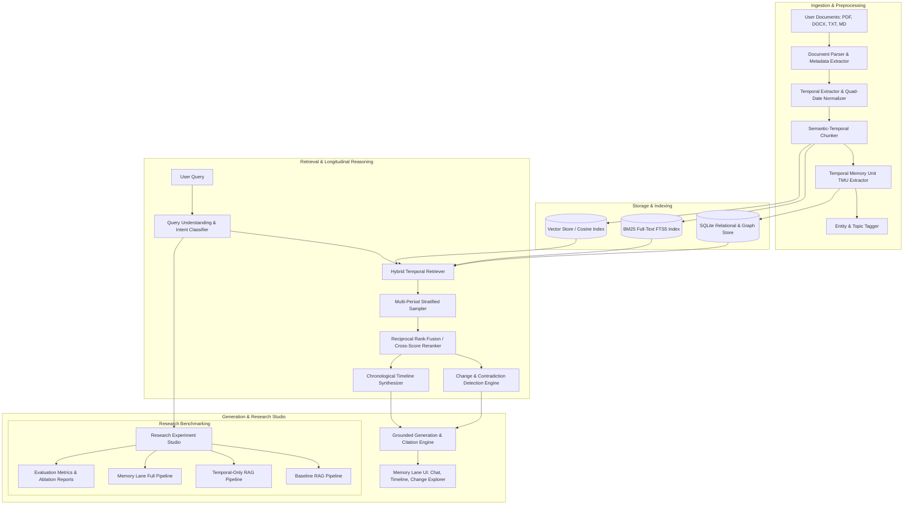

# Memory Lane RAG: System Architecture & Implementation Plan

## 1. Executive Summary & Vision

**Memory Lane RAG** is a temporal Retrieval-Augmented Generation system designed for longitudinal understanding. Traditional RAG systems treat knowledge as a static or time-agnostic snapshot, optimizing purely for semantic similarity. Consequently, they fail when answering temporal, evolutionary, or longitudinal questions such as:
- *"How has my perspective on AI shifted from 2022 to 2026?"*
- *"When did I stop working with Java and what did I replace it with?"*
- *"Did I ever reverse an earlier career goal?"*
- *"What were the major turning points in my research agenda?"*

Memory Lane RAG bridges this fundamental gap by combining:
$$\text{Memory Lane RAG} = \text{Hybrid Semantic Retrieval} + \text{Temporal Stratified Retrieval} + \text{Change-Point Detection} + \text{Longitudinal Synthesis} + \text{Calibrated Evidence Grounding}$$

---

## 2. Core Architectural Principles & Distinctions

### 2.1 The Quad-Date Model
Every document and memory fragment is tracked across four distinct temporal dimensions:
1. **Document Date ($t_{doc}$)**: When the document was authored or published (e.g., May 14, 2025).
2. **Event Date ($t_{event}$)**: When the described event, thought, or realization occurred in reality (e.g., "Back in autumn 2022, I decided..."). Can be a point in time or a time interval $[t_{start}, t_{end}]$.
3. **Ingestion Date ($t_{ingest}$)**: System metadata timestamp when the document was indexed.
4. **Version Date ($t_{ver}$)**: Specific document iteration timestamp (e.g., Resume v1 vs v4).

### 2.2 Epistemic Honesty & Calibrated Uncertainty
- The system **never** assumes internal psychological states beyond what is written.
- System outputs explicitly distinguish:
  - **Directly Stated Facts** ($\text{Explicit}$): *"In 2022, user wrote: 'I will not pursue machine learning.' "*
  - **Detected Changes** ($\text{Empirical}$): Semantic distance shift or polarity flip between two documented points.
  - **Inferred Relationships** ($\text{Inferred}$): Hypothesized connections clearly labeled with a confidence score and epistemic qualifiers (*"The documents suggest..."*).
  - **Bounded Uncertainty** ($\text{Uncertain}$): When a turning point is bounded by an interval without exact dates (*"Between June 2023 and February 2024; exact transition date unrecorded"*).

---

## 3. System Architecture Diagram



---

## 4. Detailed Data Models & Schema Design

### 4.1 SQLite Relational & Temporal Schema (`memory_lane.db`)

```sql
-- Documents table
CREATE TABLE documents (
    id TEXT PRIMARY KEY,
    user_id TEXT NOT NULL,
    title TEXT NOT NULL,
    file_path TEXT NOT NULL,
    file_type TEXT NOT NULL,
    file_size INTEGER NOT NULL,
    hash_sha256 TEXT NOT NULL,
    document_date TEXT, -- ISO8601
    created_at TEXT NOT NULL,
    metadata JSON
);

-- Chunks table
CREATE TABLE chunks (
    id TEXT PRIMARY KEY,
    document_id TEXT NOT NULL REFERENCES documents(id) ON DELETE CASCADE,
    chunk_index INTEGER NOT NULL,
    content TEXT NOT NULL,
    token_count INTEGER NOT NULL,
    page_number INTEGER,
    start_char INTEGER,
    end_char INTEGER,
    created_at TEXT NOT NULL
);

-- Temporal Memory Units (TMU)
CREATE TABLE temporal_memories (
    id TEXT PRIMARY KEY,
    document_id TEXT NOT NULL REFERENCES documents(id) ON DELETE CASCADE,
    chunk_id TEXT NOT NULL REFERENCES chunks(id) ON DELETE CASCADE,
    user_id TEXT NOT NULL,
    memory_type TEXT NOT NULL, -- belief, goal, decision, preference, knowledge, observation, plan, reflection, event
    statement TEXT NOT NULL,
    event_date_start TEXT, -- ISO8601
    event_date_end TEXT,   -- ISO8601
    date_granularity TEXT NOT NULL, -- exact_day, month, season, year, decade, unrecorded
    date_confidence REAL NOT NULL, -- 0.0 to 1.0
    date_source TEXT NOT NULL, -- explicit_in_text, doc_metadata, user_override, relative_inferred
    stance_polarity REAL, -- -1.0 (negative/rejection) to +1.0 (positive/adoption)
    entities JSON, -- ['Python', 'AI Research', 'Google']
    topics JSON,   -- ['Career', 'Machine Learning']
    created_at TEXT NOT NULL
);

-- Memory Graph Edges (Longitudinal Relationships)
CREATE TABLE memory_relationships (
    id TEXT PRIMARY KEY,
    source_memory_id TEXT NOT NULL REFERENCES temporal_memories(id) ON DELETE CASCADE,
    target_memory_id TEXT NOT NULL REFERENCES temporal_memories(id) ON DELETE CASCADE,
    relation_type TEXT NOT NULL, -- evolves_from, contradicts, supports, revises, follows, replaces
    confidence REAL NOT NULL,
    evidence_rationale TEXT,
    created_at TEXT NOT NULL
);

-- Detected Change Points
CREATE TABLE change_points (
    id TEXT PRIMARY KEY,
    user_id TEXT NOT NULL,
    topic_or_entity TEXT NOT NULL,
    from_period TEXT NOT NULL,
    to_period TEXT NOT NULL,
    change_type TEXT NOT NULL, -- gradual_evolution, sudden_shift, reversal, goal_abandonment
    magnitude REAL NOT NULL, -- 0.0 to 1.0 semantic drift score
    earlier_memory_id TEXT NOT NULL REFERENCES temporal_memories(id),
    later_memory_id TEXT NOT NULL REFERENCES temporal_memories(id),
    uncertainty_bounds TEXT,
    created_at TEXT NOT NULL
);

-- Version Comparison Snapshots
CREATE TABLE document_versions (
    id TEXT PRIMARY KEY,
    series_name TEXT NOT NULL, -- e.g. "Resume", "PhD Proposal"
    version_label TEXT NOT NULL, -- e.g. "v1_2022", "v2_2024"
    document_id TEXT NOT NULL REFERENCES documents(id) ON DELETE CASCADE,
    version_order INTEGER NOT NULL,
    version_date TEXT NOT NULL
);

-- Research Benchmark Runs
CREATE TABLE evaluation_runs (
    id TEXT PRIMARY KEY,
    run_name TEXT NOT NULL,
    config JSON NOT NULL, -- pipeline variant, ablations
    metrics JSON NOT NULL, -- recall@k, mrr, temporal_accuracy, unsupported_claim_rate, latency
    created_at TEXT NOT NULL
);
```

---

## 5. Algorithmic Innovations

### 5.1 Temporal Memory Unit (TMU) Extraction & Quad-Date Disambiguation
Rather than indexing monolithic paragraphs, the parser extracts **Temporal Memory Units (TMUs)**:
1. **Explicit temporal markers**: `r'\b(in|during|by|around|since)\s+(\d{4})\b'` or `r'\b(Jan|Feb|Mar|...)\s+\d{4}\b'`
2. **Relative temporal resolution**: `"Two years ago..."` anchored against $t_{doc}$ to derive $t_{event} = t_{doc} - 2\text{y}$.
3. **Epistemic Classification**: Categorizing statements as `belief`, `goal`, `decision`, `preference`, `event`, etc.
4. **Stance & Polarity Scoring**: Determining affinity/sentiment toward specific entities ($-1$ rejection to $+1$ adoption).

### 5.2 Multi-Period Stratified Retrieval (Preventing Recency & Density Bias)
Conventional vector search returns chunks from the dense semantic cluster (often recent documents or the longest document). 
Memory Lane's **Stratified Temporal Retriever**:
1. Groups candidates into temporal epochs/bins (e.g., Year 2022, 2023, 2024, 2025, 2026).
2. Performs **Stratified Proportional Sampling** across each active epoch.
3. Computes a composite retrieval score:
$$S_{composite}(d, q) = \alpha \cdot S_{semantic}(d, q) + \beta \cdot S_{BM25}(d, q) + \gamma \cdot S_{temporal\_intent}(d, q, t)$$
4. Applies **Reciprocal Rank Fusion (RRF)** to combine sparse, dense, and longitudinal lists.

### 5.3 Semantic Drift & Change-Point Detection
1. For an entity $E$ or topic $T$, order its associated TMUs chronologically: $\mathcal{M} = [m_1, m_2, \dots, m_N]$ sorted by $t_{event}$.
2. Compute pairwise chronological semantic distance: $\Delta_{i, j} = 1 - \cos(\mathbf{e}_i, \mathbf{e}_j)$.
3. Compute stance change: $\Delta \text{Stance}_{i, j} = |\text{polarity}_j - \text{polarity}_i|$.
4. Trigger change candidate when $\Delta_{i, i+1} > \theta_{semantic}$ or $\text{sign}(\text{polarity}_i) \ne \text{sign}(\text{polarity}_{i+1})$.
5. Quantify transition uncertainty:
$$\text{Transition Window} = [t_{event}(m_i), t_{event}(m_{i+1})]$$
If interval $> 6\text{ months}$ and no intermediate documents exist, explicitly tag as:
`"Transition observed between {start} and {end}; exact inflection point unrecorded."`

### 5.4 Contradiction & Reversal Detection
- Filter on identical entity/topic pairs across time.
- Identify polarity inversion: High positive stance ($> 0.6$) $\leftrightarrow$ High negative stance ($< -0.4$).
- Present both verified evidence excerpts side-by-side with exact dates and document provenance.

### 5.5 Calibrated Citation & Claim Provenance Engine
- Every assertion made by the synthesis engine is broken down into claims.
- Each claim is anchored to one or more `TMU` IDs and source document chunk offsets.
- The UI renders claim highlights that reveal the exact source snippet upon click.

---

## 6. Research Benchmark Framework & Ablations

The application includes a built-in **Research & Evaluation Workbench** comparing three RAG paradigms:

| Pipeline | Retrieval Mechanics | Temporal Modeling | Change Detection | Grounding |
| :--- | :--- | :--- | :--- | :--- |
| **Baseline RAG** | Top-K Dense Vector | None (Date Ignorant) | None | Standard Prompt |
| **Temporal RAG** | Vector + Date Filter/Sort | Metadata Filtering | None | Standard Prompt |
| **Memory Lane RAG** | Hybrid BM25 + Vector + Stratified Bins | Quad-Date Model + TMU | Drift & Polarity Flips | Claim Provenance + Uncertainty Bounds |

### Evaluation Metrics Implemented:
1. **Chronological Ordering Accuracy (COA)**: Fraction of events ordered correctly in synthesized answers.
2. **Recall@K (Temporal)**: Coverage of relevant historical inflection periods.
3. **Change-Point Detection F1**: Precision and Recall of detected transitions vs ground-truth annotations.
4. **Unsupported Historical Claim Rate (UHCR)**: Proportion of claims lacking direct textual backing.
5. **Epistemic Calibration Score (ECS)**: Correctness of uncertainty qualification when intervals are sparse.
6. **Query Latency & Token Economy**: Computational cost overhead breakdown.

---

## 7. Technology Stack Selection

- **Backend**:
  - Python 3.13 + **FastAPI** (Async, high performance, OpenAPI documentation).
  - **SQLite + FTS5** for relational persistence, structured metadata, and BM25 full-text indexing.
  - **Embedding & Vector Engine**: High-performance local vector indexer (with numpy cosine similarity + Chroma / FAISS support) + pluggable LLM/Embedding adapters (Gemini 2.5/1.5, OpenAI, or zero-cost deterministic test fixtures).
  - Document Extractors: `pypdf`, `python-docx`, Markdown/TXT parser, date extraction via regex and contextual normalization.
- **Frontend**:
  - **React 18 + Vite + TypeScript**.
  - Modern bespoke styling with CSS tokens (rich dark mode, glassmorphism, responsive desktop & mobile).
  - **Lucide Icons** for polished iconography.
  - Interactive components: Chronological Zoom Timeline, Change Trajectory Flow, Contradiction Diff Drawer, Document Provenance Inspector, Research Metric Visualizers.
- **Security & Privacy**:
  - Per-user scoping and sandbox execution.
  - Document text sanitization against prompt injection.
  - Comprehensive cascade deletion (documents $\to$ chunks $\to$ TMUs $\to$ embeddings).

---

## 8. Development Phases & Milestones

- [x] **Milestone 0: Architecture & Research Specification** (Current plan completed).
- [ ] **Phase 1: Backend Foundation & Ingestion Engine**
  - Project directory setup, virtualenv, dependencies (`fastapi`, `uvicorn`, `pydantic`, `pypdf`, `python-docx`, etc.).
  - Database schema, migrations, and repository layer.
  - Quad-Date parser, semantic chunker, TMU extractor.
- [ ] **Phase 2: Hybrid Indexing & Stratified Temporal Retrieval**
  - BM25 FTS5 implementation + Vector similarity index.
  - Temporal query router (FACT_LOOKUP, EVOLUTION_ANALYSIS, CONTRADICTION_ANALYSIS, etc.).
  - Multi-period stratified sampling & Reciprocal Rank Fusion reranker.
- [ ] **Phase 3: Longitudinal Reasoning Core**
  - Semantic drift and change-point detector.
  - Contradiction / polarity reversal engine.
  - Version comparison and diff engine for document revisions.
  - Memory graph generator.
- [ ] **Phase 4: Grounded Synthesis, Uncertainty Calibration & API**
  - Evidence-grounded synthesis with structured claim-provenance citations.
  - Calibrated uncertainty formatter.
  - Complete REST API endpoints with OpenAPI specs.
- [ ] **Phase 5: Research Benchmarking Suite**
  - Implementation of Baseline RAG, Temporal RAG, and Memory Lane RAG runners.
  - Benchmark datasets (real & curated synthetic longitudinal trajectories: 2022-2026).
  - Evaluation metric calculation (COA, Change-Point F1, UHCR, Latency).
- [ ] **Phase 6: Modern Interactive Frontend UI**
  - Vite + React + TypeScript setup with custom design system.
  - "Ask Memory Lane" longitudinal chat interface with interactive citations.
  - "Visual Timeline" zoomable explorer.
  - "Change Explorer" & "Contradiction Explorer".
  - "Version Diff" explorer.
  - "Document Studio" for upload & temporal inspection.
  - "Research Workbench" for running and viewing comparative benchmarks.
- [ ] **Phase 7: End-to-End Verification & Validation**
  - Comprehensive unit and integration test suite.
  - Live ingestion and temporal query execution tests.
  - Final documentation and operational runbook.
